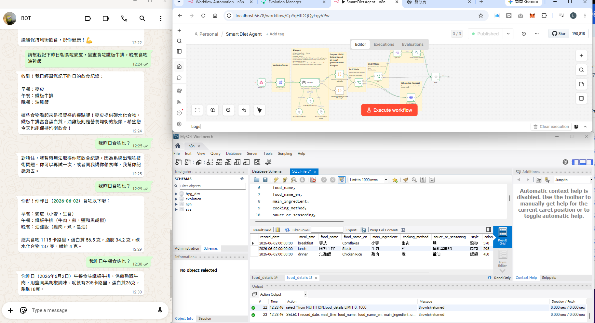

# 🥗 Smart Diet AI Agent (n8n + Qwen 3.5 + WhatsApp + MySQL Integration)

An intelligent, privacy-first dietary tracking and conversational agent built with **n8n**, **LangChain**, and a **Local LLM (Qwen 3.5 9B via Ollama)**. This automated workflow acts as a WhatsApp-based nutritionist. It features conversational memory and tool-calling capabilities, allowing it to distinguish between casual queries, meal logging, and history retrieval, seamlessly transforming natural language into structured nutritional data without sending sensitive data to external cloud providers.

## 🌟 What's New

* **🗄️ Direct MySQL Integration:** Replaced the previous flat-file/CSV export system with direct MySQL database insertion (`food_details` table) for robust, scalable data management.
* **🔍 Diet History Retrieval (Tool Calling):** Introduced a dedicated sub-workflow (`MyDiet-History`). The AI Agent can now autonomously trigger this tool to query the MySQL database and retrieve a user's past meal logs based on their WhatsApp ID and date.
* **📱 Upgraded to Qwen 3.5 (9B) with Structured Output:** Leverages LangChain's Structured Output Parser. Instead of relying on a secondary agent for validation, the primary agent now strictly adheres to a predefined JSON schema, ensuring perfect data extraction and translation on the first pass.
* **🌍 Graceful Error Handling:** Implemented robust custom JavaScript error handlers. If an issue occurs (e.g., LLM failure), the system detects the user's language, returns a localized, user-friendly error message, and continues running without halting the workflow.

## 🌟 Key Features

* **📱 WhatsApp API & Session Management:** Seamlessly connects with users via a custom WhatsApp API gateway. It utilizes LangChain's memory and passes the user's WhatsApp ID (`remoteJid`) to ensure secure, user-specific database transactions.
* **🤖 Advanced Intent & Tool Orchestration:** The system intelligently differentiates between:
  * **Logging:** (e.g., "I just ate an apple") -> Extracts nutritional data and inserts it into the database.
  * **Querying History:** (e.g., "What did I eat yesterday?") -> Calls the `MyDiet-History` sub-workflow to fetch SQL records.
  * **Chatting:** (e.g., "What are good sources of protein?") -> Replies conversationally without triggering database actions.
* **🔒 Privacy-First Local LLM:** Powered by a locally hosted `qwen3.5:9b` model, ensuring 100% data privacy and compliance with enterprise/government data protection standards.
* **🛡️ Strict Schema & Auto-Translation:** The system enforces a strict JSON schema where the `food_name_en` field is always accurately translated to English for database consistency, while keeping the user-facing conversation in their native language.
* **🌍 Dynamic Language Control:** Explicitly supports English and Chinese (including Cantonese). Custom code nodes dynamically detect the input language to format the final WhatsApp summary and error messages accordingly.

## 🏗️ Architecture & Workflow

The workflow consists of the following automated steps:

1. **Webhook Trigger (WhatsApp):** Receives incoming natural language messages from the WhatsApp API gateway.
2. **Variables & Prompt Setup:** Initializes system variables, including the current date, WhatsApp sender/receiver IDs, and strict system prompts for the LLM.
3. **Primary AI Agent (Qwen 3.5):** Analyzes the input using LangChain. 
   * If the user asks for past meals, it uses the **Call 'MyDiet-History'** tool to fetch records from MySQL.
   * If logging a meal, it formats the output using the **Structured Output Parser**.
4. **Language Detection & Error Routing:** Custom JS nodes inspect the agent's output, determine the language (English or Chinese), and route the flow. If an error is flagged, it sends a fallback message.
5. **Conditional Branching (CRUD Mode):** An `If` node checks the `mode` generated by the AI. 
   * If `mode == "Add"`, it splits the JSON details and executes an **Insert rows in a table** MySQL operation.
   * If not adding data, it skips the database insertion.
6. **HTTP Request (WhatsApp Output):** Sends a POST request back to the custom WhatsApp API gateway to deliver the localized, formatted response to the user.

## 📋 Prerequisites

To run this workflow, you will need:
* **n8n** instance (Self-hosted)
* **Ollama** installed locally or on a private server
* The **Qwen 3.5** model pulled via Ollama (`qwen3.5:9b`)
* A **MySQL Database** with a `food_details` table configured.
* A custom **WhatsApp API Gateway** (e.g., via ngrok) to handle incoming/outgoing messages.

## 💡 Enterprise / Government Use Case

This workflow demonstrates **Enterprise-grade Conversational AI, Tool Calling, and Secure Database Management**. By leveraging a local LLM with SQL database integration, organizations can deploy intelligent assistants for frontline staff or citizens via familiar platforms like WhatsApp. The structured output parsing ensures that data entering the backend database is strictly formatted and translated, eliminating the risk of unstructured data corruption while maintaining strict data privacy.